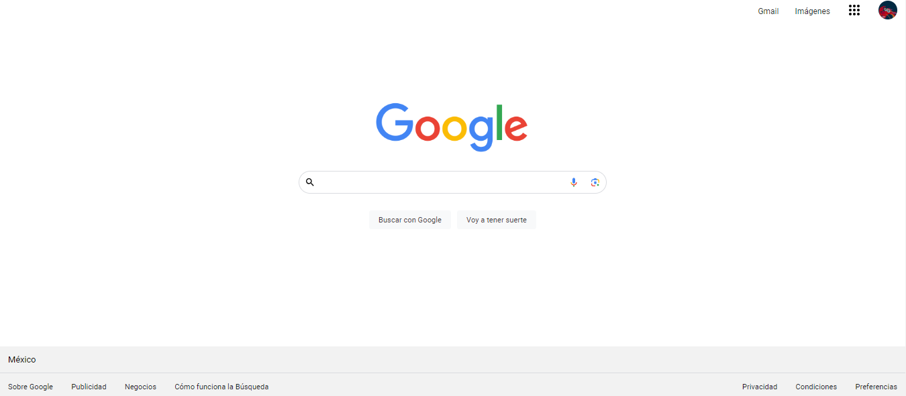

# Clon de Google

El presente proyecto es un clon de la página principal de Google, creado para poner en práctica las habilidades en HTML y CSS.

## Descripción

Este proyecto fue desarrollado con el objetivo de replicar la interfaz de usuario de la página de inicio de Google utilizando tecnologías web básicas. 

- **HTML:** Estructura de la página.
- **CSS:** Estilizado de la página para replicar el diseño de Google.

Puedes ver una demostración del proyecto en el siguiente enlace: [Clon de Google](https://clon-google-b7-g2.vercel.app/)

### Vista general

La página principal del clon incluye los siguientes elementos:
- Barra de búsqueda central.
- Logotipo de Google.
- Enlaces a otros servicios de Google en la parte superior derecha.

Desarrollado con 💙 por [Camila](https://linktr.ee/camijimfi) en [TECHNOLOCHICAS PRO](https://tecnolochicas.mx/).

